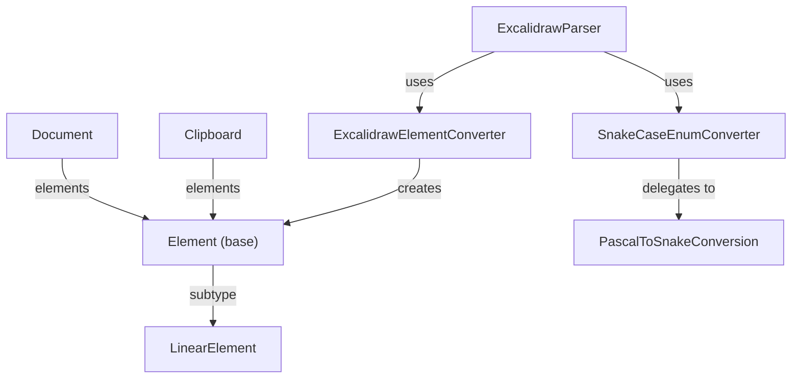

# ExcaliDraw

Excalidraw data model, parser, serializer, and JSON conversion utilities.
All types reside in the `org.SpocWeb.PptxToJson.ExcaliDraw` namespace.

## Classes

| Class | Responsibility | Key Collaborators |
|---|---|---|
| [Excalidraw](Excalidraw.public.cs) | Partial root class grouping all Excalidraw types and helpers. | All element and model classes |
| [Excalidraw.Document](Excalidraw.Document.cs) | Root scene object (schema version 2): `elements`, `appState`, `files`. | `Element`, `AppState`, `BinaryFileData` |
| [Excalidraw.Clipboard](Excalidraw.Document.cs) | Clipboard-format variant (`"excalidraw/clipboard"`) for copied element subsets. | `Element`, `BinaryFileData` |
| [Element](Excalidraw.elements.cs) | Abstract base for all canvas elements; holds id, position, styling, grouping, versioning and collaboration metadata. | All concrete element subclasses |
| [LinearElement](Excalidraw.elements.cs) | Intermediate base for line and arrow elements; adds `points`, `startBinding`, `endBinding` and arrowheads. | `Arrow`, `LineElement`, `PointBinding` |
| [Arrow](Excalidraw.elements.cs) | Directed arrow with optional 90° elbow routing and typed arrowhead decorations. | `LinearElement`, `Arrowhead` |
| [LineElement](Excalidraw.elements.cs) | Undirected polyline; optionally closed into a polygon via `polygon = true`. | `LinearElement` |
| [RectangleElement](Excalidraw.elements.cs) | Axis-aligned rectangle shape. | `Element` |
| [EllipseElement](Excalidraw.elements.cs) | Ellipse (or circle when width == height) shape. | `Element` |
| [DiamondElement](Excalidraw.elements.cs) | Diamond (rotated square) shape. | `Element` |
| [FreedrawElement](Excalidraw.elements.cs) | Freehand stroke with optional per-point stylus pressure data. | `Element` |
| [TextElement](Excalidraw.elements.cs) | Standalone or container-bound text label with font and alignment properties. | `Element`, `FontFamily`, `TextAlign`, `VerticalAlign` |
| [ImageElement](Excalidraw.elements.cs) | Raster image referenced by SHA-1 `fileId` from the document `files` map. | `Element`, `BinaryFileData`, `ImageCrop` |
| [ImageCrop](Excalidraw.elements.cs) | Active crop rectangle applied to an image, in natural pixel coordinates. | `ImageElement` |
| [FrameElement](Excalidraw.elements.cs) | Named frame that visually groups and clips child elements. | `Element` |
| [MagicFrameElement](Excalidraw.elements.cs) | AI-generated frame produced by Excalidraw's generative features. | `Element` |
| [EmbeddableElement](Excalidraw.elements.cs) | Embeds an external web resource rendered as an interactive canvas widget. | `Element` |
| [IFrameElement](Excalidraw.elements.cs) | Inline iframe for arbitrary HTML content on the canvas. | `Element` |
| [ElementBounds](ElementBounds.cs) | Value `record struct` for x, y, width, height and `AngleRadians`. | All element constructors |
| [Roundness](Excalidraw.model.cs) | Corner-rounding configuration (`RoundnessType` + optional explicit radius). | `Element` |
| [BoundElement](Excalidraw.model.cs) | Reference from a container element to a bound arrow or text element. | `Element.boundElements` |
| [PointBinding](Excalidraw.model.cs) | Arrow-tip attachment: target `elementId`, `focus`, `gap`, optional `fixedPoint`. | `LinearElement` |
| [BinaryFileData](Excalidraw.model.cs) | Binary file entry: MIME type, SHA-1 id, base-64 dataURL, created/lastRetrieved timestamps. | `Document.files`, `ImageElement` |
| [AppState](Excalidraw.model.cs) | Serializable editor state written to disk: background color, grid, theme, current tool defaults, scroll, zoom. | `Document.appState` |
| [ExcalidrawParser](ExcalidrawParser.cs) | Static entry point for parsing and serializing `Document` and `Clipboard` using pre-configured `JsonSerializerSettings`. | `ExcalidrawElementConverter`, `SnakeCaseEnumConverter` |
| [ExcalidrawElementConverter](ExcalidrawElementConverter.cs) | Read-only `JsonConverter<Element>` that reads the `"type"` discriminator and instantiates the matching subclass. | All `Element` subtypes |
| [SnakeCaseEnumConverter](SnakeCaseEnumConverter.cs) | `JsonConverter` that round-trips enum values as `snake_case` strings via `PascalToSnakeConversion`. | `PascalToSnakeConversion` |
| [PascalToSnakeConversion](PascalToSnakeConversion.cs) | Thread-safe, cached PascalCase→snake_case utilities; used by `SnakeCaseEnumConverter`. | `SnakeCaseEnumConverter` |
| [IHaveSequence&lt;T&gt;](IHaveSequence.cs) | Interface and static helpers for monotonically incrementing sequence counters; generates deterministic ids and seeds. | Element constructors |

## Relationships

See also: parent project summary in [../ReadMe.md](../ReadMe.md).
