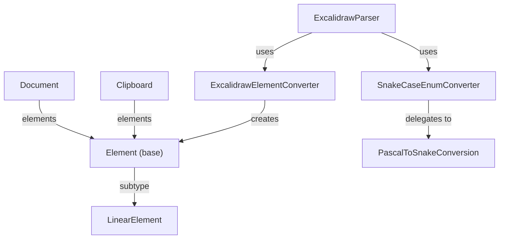

---
digest:
  local-classes:
    AppState:
      mtime: "2026-06-09T16:08:50Z"
      digest: "19ef3883807c7171bfb6b9adeeabf68538a91dab0e791756b9390739121ce6cb"
    Arrow:
      mtime: "2026-06-09T16:08:50Z"
      digest: "0505b14edc4bc1c1311dcf294b40ab6c8fdaa9ba194687a4c150edb0ea6dd091"
    Arrowhead:
      mtime: "2026-06-09T16:08:50Z"
      digest: "92b5d3622d789c148b1cbf6db32a3771693b2fdc1824d6c2887da7ef849c05e4"
    BinaryFileData:
      mtime: "2026-06-09T16:08:50Z"
      digest: "1eac90f0ec8e34ad3b55f8771984b54d2ceb72c1fa044a7f0a547e69c59ffa07"
    BoundElement:
      mtime: "2026-06-09T16:08:50Z"
      digest: "066472cd92cb1e65c35dcb9a7005588ea9959e360fe342f475d86a4c147ed5b0"
    Clipboard:
      mtime: "2026-06-09T16:08:50Z"
      digest: "a6ccdd4824f49a12a5e5779b1929ceec8be10e27839735e165e1e743670ed7c9"
    DiamondElement:
      mtime: "2026-06-09T16:08:50Z"
      digest: "938dea4088d89746c8db83fed844daa24fb2b369983d90865ab797e7acfdbf35"
    Document:
      mtime: "2026-06-09T16:08:50Z"
      digest: "7906218b504544b3aed851ec0827813c54ea8d612383d023c12a2341efb454a2"
    Element:
      mtime: "2026-06-09T16:08:50Z"
      digest: "00dd43a41bb2f6dc3a49516a6087b402fc7d1bf4ac21534f92776bf278557879"
    ElementBounds:
      mtime: "2026-06-09T16:08:50Z"
      digest: "eb13646dd38100244bc627294c9251cbc985152b1c7ebb2a6545f3479b1bd45e"
    ElementType:
      mtime: "2026-06-09T16:08:50Z"
      digest: "fa11011ba62baa2582584a5e2ebb34053d768d629642d5cac9fa578a64bd237b"
    EllipseElement:
      mtime: "2026-06-09T16:08:50Z"
      digest: "88ca0892e541e80785eb95b8fdc5e33df1e6841cf47beee13611a5b8c2994edf"
    EmbeddableElement:
      mtime: "2026-06-09T16:08:50Z"
      digest: "2e2a47aad35618e502f2cda987731c182412386040f86a8c122ab61ef55595b2"
    Excalidraw:
      mtime: "2026-06-09T16:08:50Z"
      digest: "e3b0c44298fc1c149afbf4c8996fb92427ae41e4649b934ca495991b7852b855"
    ExcalidrawElementConverter:
      mtime: "2026-06-09T16:08:50Z"
      digest: "2a84a6a25114a9c263a9b773430d58c6912b15c02d8902a11e54e3ee03f5c3a5"
    ExcalidrawParser:
      mtime: "2026-06-09T16:08:50Z"
      digest: "c4515cd808a9156dafc013fca213b8f110b459e5db468142cfdabb9f0d7abdbd"
    FillStyle:
      mtime: "2026-06-09T16:08:50Z"
      digest: "a5476e8c60205771c2e5238fe290ae01e1585c89c9a459a458c79ede418dceb9"
    FontFamily:
      mtime: "2026-06-09T16:08:50Z"
      digest: "68730d1c960e17ebcea046ec7b084f28506a3f863c5b417f66116d1806bf2442"
    FrameElement:
      mtime: "2026-06-09T16:08:50Z"
      digest: "d5ca03d313d97389d4947ac505e8a4c4f45f9c7a96be236d4fa4617fcfae4841"
    FreedrawElement:
      mtime: "2026-06-09T16:08:50Z"
      digest: "acbef79f8bd8d16fd9ddcb351f31d79eccf5d00c896cc2abb1ed1bb05fe92ce6"
    IFrameElement:
      mtime: "2026-06-09T16:08:50Z"
      digest: "50ec4d2b1ff0046f8f2a9885aaa32409bce0655928bba636fa1923386a389d0c"
    IHaveSequence:
      mtime: "2026-06-09T16:08:50Z"
      digest: "8b7666f23b5ac8ea1003f24859c6bd4898e0132c391be9d2a2cfb3f24fb1444b"
    ImageCrop:
      mtime: "2026-06-09T16:08:50Z"
      digest: "cae8b3242cc04c5e5d7f8bfa4302b37a40adff0836b5c7c5fc5720bf5ac7edfe"
    ImageElement:
      mtime: "2026-06-09T16:08:50Z"
      digest: "3a1be6f68af968b21632c4483879c2519fe1c1f69b07f79774f705bfda1ba1a4"
    ImageStatus:
      mtime: "2026-06-09T16:08:50Z"
      digest: "7cef962c17b32e33b62e5313119e92fa8b8483f349d8ce31431a78934a79c108"
    LinearElement:
      mtime: "2026-06-09T16:08:50Z"
      digest: "14d176b2956813fd19adb4f4bebaeccb963a622777e739e9b5449a5d4daa57c7"
    LineElement:
      mtime: "2026-06-09T16:08:50Z"
      digest: "c41e97c1cfe2e234ee1d322147ec96516e6d0ad6ed2b6faf7f2178a7b8a32522"
    MagicFrameElement:
      mtime: "2026-06-09T16:08:50Z"
      digest: "10c4a0f483a16d480a9390e11a8f784a4480a7c3634a8510d6f87a75d327ece4"
    PascalToSnakeConversion:
      mtime: "2026-06-09T16:08:50Z"
      digest: "6164c28ddf066b8eee4a240d6ae71d536fef5252f3e7d9312ef5dd46c39fe0d2"
    PointBinding:
      mtime: "2026-06-09T16:08:50Z"
      digest: "f516121ad2c29449876cf47ab4ab1d09e250672aef71db59b59eff38fe7d4a70"
    RectangleElement:
      mtime: "2026-06-09T16:08:50Z"
      digest: "dbf553a66b7a0528d1c5170ff9c4d7babdb69942e9510ce21f860c22f29736d5"
    Roundness:
      mtime: "2026-06-09T16:08:50Z"
      digest: "6298ab8a2f2fc4f8de29a9bcb35de669f7a95dab4d52671507298107b76d10ef"
    RoundnessType:
      mtime: "2026-06-09T16:08:50Z"
      digest: "46d684972f3005020f05063c641f25747b225810c04fa5d9f7c4b5646a14cb78"
    SnakeCaseEnumConverter:
      mtime: "2026-06-09T16:08:50Z"
      digest: "2bec9cc2474af270007ab0ff7d64dae4a4c7ac6a3e7f54a84bb1843eb4750047"
    StrokeStyle:
      mtime: "2026-06-09T16:08:50Z"
      digest: "c6b74d09157f269b9b58325a82eddca2e9b3f304ad12c47e5d052854210f67ad"
    TextAlign:
      mtime: "2026-06-09T16:08:50Z"
      digest: "f7dd87d2cf91220e75d9c2ad7c954fc4ed77e6cf7c9390ffb4c0148867b90a8f"
    TextElement:
      mtime: "2026-06-09T16:08:50Z"
      digest: "9d258720f987f3053db79b3fd54f36d42dddb115cc01097b07d1197e76076842"
    VerticalAlign:
      mtime: "2026-06-09T16:08:50Z"
      digest: "e162f6cdc78dd6bbfa78fa4b555ae715009dfea3f7e35bfd49f43b6ed8636459"
  folders: {}
---
# ExcaliDraw

Excalidraw data model, parser, serializer, and JSON conversion utilities.
All types reside in the `org.SpocWeb.PptxToJson.ExcaliDraw` namespace.

## Architecture

```mermaid
flowchart TD
    subgraph Document["Document Layer"]
        Doc["Document"]
        Clip["Clipboard"]
        AppState["AppState"]
        BinFile["BinaryFileData"]
    end

    subgraph Elements["Element Hierarchy"]
        Elem["Element (base)"]
        Rect["RectangleElement"]
        Ellipse["EllipseElement"]
        Diamond["DiamondElement"]
        Freedraw["FreedrawElement"]
        Text["TextElement"]
        Image["ImageElement"]
        Frame["FrameElement"]
        MagicFrame["MagicFrameElement"]
        Embeddable["EmbeddableElement"]
        IFrame["IFrameElement"]
        Linear["LinearElement"]
        Line["LineElement"]
        Arrow["Arrow"]
        ImageCrop["ImageCrop"]
        PointBinding["PointBinding"]
        BoundElement["BoundElement"]
        Roundness["Roundness"]
        ElementBounds["ElementBounds"]
    end

    subgraph Enums["Enums"]
        ElemType["ElementType"]
        FillStyle["FillStyle"]
        StrokeStyle["StrokeStyle"]
        Arrowhead["Arrowhead"]
        TextAlign["TextAlign"]
        VerticalAlign["VerticalAlign"]
        FontFamily["FontFamily"]
        ImageStatus["ImageStatus"]
        RoundnessType["RoundnessType"]
    end

    subgraph Utilities["JSON Utilities"]
        Parser["ExcalidrawParser"]
        Converter["ExcalidrawElementConverter"]
        SnakeConv["SnakeCaseEnumConverter"]
        Pascal["PascalToSnakeConversion"]
        ISeq["IHaveSequence&lt;T&gt;"]
    end

    Doc -->|"elements: List&lt;Element&gt;"| Elem
    Doc -->|"appState"| AppState
    Doc -->|"files: Dict"| BinFile
    Clip -->|"elements: List&lt;Element&gt;"| Elem
    Clip -->|"files: Dict"| BinFile

    linkStyle 0 opacity:1
    linkStyle 1 opacity:1
    linkStyle 2 opacity:1
    linkStyle 3 opacity:1
    linkStyle 4 opacity:1

    Elem -->|"extends"| Rect
    Elem -->|"extends"| Ellipse
    Elem -->|"extends"| Diamond
    Elem -->|"extends"| Freedraw
    Elem -->|"extends"| Text

    linkStyle 5 opacity:1
    linkStyle 6 opacity:1
    linkStyle 7 opacity:1
    linkStyle 8 opacity:1
    linkStyle 9 opacity:1

    Elem -->|"extends"| Image
    Elem -->|"extends"| Frame
    Elem -->|"extends"| MagicFrame
    Elem -->|"extends"| Embeddable
    Elem -->|"extends"| IFrame

    linkStyle 10 opacity:1
    linkStyle 11 opacity:1
    linkStyle 12 opacity:1
    linkStyle 13 opacity:1
    linkStyle 14 opacity:1

    Elem -->|"extends"| Linear
    Linear -->|"extends"| Line
    Linear -->|"extends"| Arrow
    Linear -->|"startBinding/endBinding"| PointBinding
    Image -->|"crop"| ImageCrop

    linkStyle 15 opacity:1
    linkStyle 16 opacity:1
    linkStyle 17 opacity:1
    linkStyle 18 opacity:1
    linkStyle 19 opacity:1

    Image -->|"fileId →"| BinFile
    Elem -->|"boundElements"| BoundElement
    Elem -->|"roundness"| Roundness
    Roundness -->|"type"| RoundnessType
    Elem -->|"type discriminator"| ElemType

    linkStyle 20 opacity:1
    linkStyle 21 opacity:1
    linkStyle 22 opacity:1
    linkStyle 23 opacity:1
    linkStyle 24 opacity:1

    Elem -->|"constructed via"| ElementBounds
    Parser -->|"uses"| Converter
    Parser -->|"uses"| SnakeConv
    SnakeConv -->|"delegates"| Pascal
    Converter -->|"instantiates"| Elem

    linkStyle 25 opacity:1
    linkStyle 26 opacity:1
    linkStyle 27 opacity:1
    linkStyle 28 opacity:1
    linkStyle 29 opacity:1

    ISeq -->|"used by ctors of"| Elem
```

## Classes

| Class | Responsibility |
|---|---|
| [ElementBounds](ElementBounds.cs) | Similar to Rectangle but with AngleRadians |
| [Excalidraw](Excalidraw.Document.cs) | Partial class hosting the Excalidraw scene document and clipboard types. |
| [Document](Excalidraw.Document.cs) | Root object for an `. |
| [Clipboard](Excalidraw.Document.cs) | Clipboard-format variant produced when copying selected elements. |
| [Excalidraw](Excalidraw.elements.cs) | Partial class hosting all Excalidraw element types and their base class. |
| [Element](Excalidraw.elements.cs) | Graphic Element Base-Class of type |
| [RectangleElement](Excalidraw.elements.cs) | Axis-aligned rectangle shape element. |
| [EllipseElement](Excalidraw.elements.cs) | Ellipse (or circle when width == height) shape element. |
| [DiamondElement](Excalidraw.elements.cs) | Diamond (rotated square) shape element. |
| [LinearElement](Excalidraw.elements.cs) | Base class for elements composed of an ordered array of points: lines and arrows. |
| [LineElement](Excalidraw.elements.cs) | Undirected straight or curved line through two or more points. |
| [Arrow](Excalidraw.elements.cs) | Directed arrow with optional endpoint bindings and arrowhead decorations. |
| [FreedrawElement](Excalidraw.elements.cs) | Freehand stroke captured from pointer input. |
| [TextElement](Excalidraw.elements.cs) | Text label element, either standalone or bound to a container shape. |
| [ImageElement](Excalidraw.elements.cs) | Raster image whose binary content is stored in the document-level `files` map keyed by fileId. |
| [ImageCrop](Excalidraw.elements.cs) | Crop rectangle applied to an image element |
| [FrameElement](Excalidraw.elements.cs) | Named frame that visually groups and clips its child elements. |
| [MagicFrameElement](Excalidraw.elements.cs) | AI-generated magic frame. |
| [EmbeddableElement](Excalidraw.elements.cs) | Embeds an external web resource (URL) rendered as an interactive widget. |
| [IFrameElement](Excalidraw.elements.cs) | Inline iframe for arbitrary HTML content directly on the canvas. |
| [Excalidraw](Excalidraw.enums.cs) | Enums and static Helper Methods to parse Excalidraw JSON |
| [ElementType](Excalidraw.enums.cs) | AKA ShapeType; Discriminates the concrete element subtype stored in the elements array. |
| [FillStyle](Excalidraw.enums.cs) | Filling of the interior of a closed shape |
| [StrokeStyle](Excalidraw.enums.cs) | dash pattern applied to an element's stroke (outline). |
| [Arrowhead](Excalidraw.enums.cs) | Decoration rendered at the start or end point of an Arrow element. |
| [TextAlign](Excalidraw.enums.cs) | Horizontal alignment of text within its bounding box. |
| [VerticalAlign](Excalidraw.enums.cs) | Vertical alignment of text within its bounding box or container shape. |
| [FontFamily](Excalidraw.enums.cs) | Built-in font families available in Excalidraw. |
| [ImageStatus](Excalidraw.enums.cs) | Load/persistence state of an Image element's binary data. |
| [RoundnessType](Excalidraw.enums.cs) | Determines how corner rounding is computed for a shape. |
| [Excalidraw](Excalidraw.model.cs) | Partial class hosting the Excalidraw model types: Roundness, BoundElement, PointBinding, BinaryFileData and AppState. |
| [Roundness](Excalidraw.model.cs) | Corner-rounding configuration attached to any closed shape element. |
| [BoundElement](Excalidraw.model.cs) | Reference from a container element to a bound arrow or text element. |
| [PointBinding](Excalidraw.model.cs) | binding that attaches an arrow tip to a specific point on a bindable Shape. |
| [BinaryFileData](Excalidraw.model.cs) | Binary file entry stored in the document-level `files` map. |
| [AppState](Excalidraw.model.cs) | Serializable subset of editor application state written to disk. |
| [Excalidraw](Excalidraw.public.cs) | Partial root class grouping all Excalidraw types and helpers. |
| [ExcalidrawElementConverter](ExcalidrawElementConverter.cs) | Custom Newtonsoft JsonConverter that reads the `"type"` discriminator from each element token and instantiates the correct Element subclass before populating it. |
| [ExcalidrawParser](ExcalidrawParser.cs) |  |
| [IHaveSequence](IHaveSequence.cs) | Contract for objects that carry a monotonically incrementing integer sequence counter. |
| [IHaveSequence](IHaveSequence.cs) | Extension helpers for IHaveSequence that generate Excalidraw-compatible ids and seeds. |
| [PascalToSnakeConversion](PascalToSnakeConversion.cs) | Thread-safe cached PascalCase-to-snake_case conversion utilities for enum serialization. |
| [SnakeCaseEnumConverter](SnakeCaseEnumConverter.cs) | Newtonsoft. |

## Relationships

See also: parent project summary in [../ReadMe.md](../ReadMe.md).
