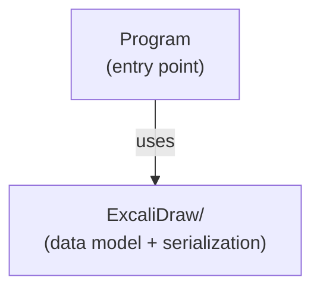

# SpocWeb.Excalidraw

This folder contains `Program`: application entry point for the SpocWeb.

## Classes

| Class | Responsibility |
|---|---|
| [Program](Program.cs) | Application entry point for the SpocWeb. |

## Subsystems

| Folder | Domain Role |
|---|---|
| [`ExcaliDraw/`](ExcaliDraw/ReadMe.md) | Excalidraw data model, parser, serializer, and JSON conversion utilities. |

## Architecture

