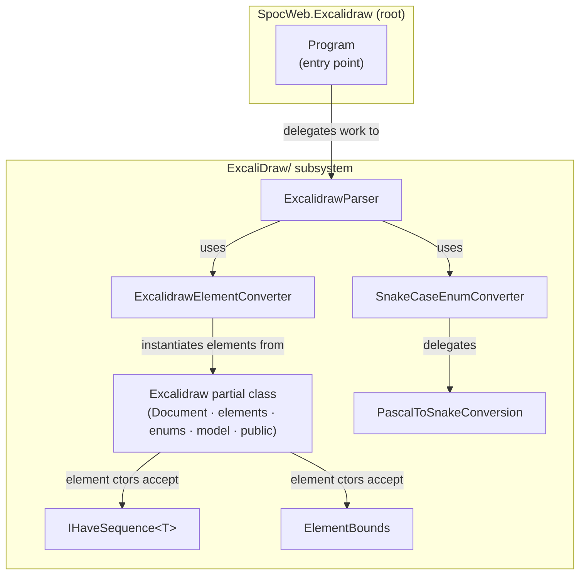
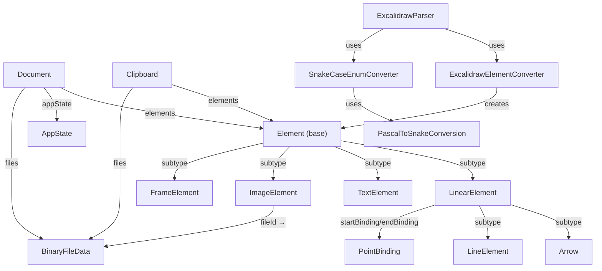

<details><summary><span style="font-size:24px;font-weight:bold">Content</span></summary>
[[_TOC_]]

</details>

# SpocWeb.Excalidraw

<!-- digest-map
local-classes:
  AppState: mtime=2026-05-15T20:56:12Z digest=8e3bd7e1288d4ca0bed69587ec0867c4a44255f665cc45018a066de5bebed3c6
  Arrow: mtime=2026-05-15T20:57:01Z digest=b390d9e832cad8a4119eca03b771d6044717604550b67134271e51d20afa58d6
  BinaryFileData: mtime=2026-05-15T20:56:12Z digest=8e3bd7e1288d4ca0bed69587ec0867c4a44255f665cc45018a066de5bebed3c6
  BoundElement: mtime=2026-05-15T20:56:12Z digest=8e3bd7e1288d4ca0bed69587ec0867c4a44255f665cc45018a066de5bebed3c6
  Clipboard: mtime=2026-05-03T11:15:42Z digest=20970f1734f1138a24fae14a8a5d46479de0c31d4930f22a962f48fbbc1bd435
  DiamondElement: mtime=2026-05-15T20:57:01Z digest=b390d9e832cad8a4119eca03b771d6044717604550b67134271e51d20afa58d6
  Document: mtime=2026-05-03T11:15:42Z digest=20970f1734f1138a24fae14a8a5d46479de0c31d4930f22a962f48fbbc1bd435
  Element: mtime=2026-05-15T20:57:01Z digest=b390d9e832cad8a4119eca03b771d6044717604550b67134271e51d20afa58d6
  ElementBounds: mtime=2026-05-15T20:55:59Z digest=bcae9ce00ceab71fbd3e569f2256e842c60f3f559f9d378303e20923f65942e4
  EllipseElement: mtime=2026-05-15T20:57:01Z digest=b390d9e832cad8a4119eca03b771d6044717604550b67134271e51d20afa58d6
  EmbeddableElement: mtime=2026-05-15T20:57:01Z digest=b390d9e832cad8a4119eca03b771d6044717604550b67134271e51d20afa58d6
  Excalidraw: mtime=2026-05-10T16:16:18Z digest=ee572f5132b448e06a93d1830b2416bd13a91650e13f869a966de317fc2c8348
  ExcalidrawElementConverter: mtime=2026-05-04T06:50:08Z digest=6bd1a4123c70999cdb57f1abbdadef8453fec2e9a8482179d72178918f415bcd
  ExcalidrawParser: mtime=2026-05-15T20:56:05Z digest=beb3737587544cb4f2871cfd7db7397dbf510d7d76ef91e74d4561c5a2c315bf
  FrameElement: mtime=2026-05-15T20:57:01Z digest=b390d9e832cad8a4119eca03b771d6044717604550b67134271e51d20afa58d6
  FreedrawElement: mtime=2026-05-15T20:57:01Z digest=b390d9e832cad8a4119eca03b771d6044717604550b67134271e51d20afa58d6
  IFrameElement: mtime=2026-05-15T20:57:01Z digest=b390d9e832cad8a4119eca03b771d6044717604550b67134271e51d20afa58d6
  IHaveSequence: mtime=2026-05-02T09:43:19Z digest=fc3f3f23b7d70d32067dd5a9256b2fc966270faeae3e1c775ff380e787da67b8
  ImageCrop: mtime=2026-05-15T20:57:01Z digest=b390d9e832cad8a4119eca03b771d6044717604550b67134271e51d20afa58d6
  ImageElement: mtime=2026-05-15T20:57:01Z digest=b390d9e832cad8a4119eca03b771d6044717604550b67134271e51d20afa58d6
  LinearElement: mtime=2026-05-15T20:57:01Z digest=b390d9e832cad8a4119eca03b771d6044717604550b67134271e51d20afa58d6
  LineElement: mtime=2026-05-15T20:57:01Z digest=b390d9e832cad8a4119eca03b771d6044717604550b67134271e51d20afa58d6
  MagicFrameElement: mtime=2026-05-15T20:57:01Z digest=b390d9e832cad8a4119eca03b771d6044717604550b67134271e51d20afa58d6
  PascalToSnakeConversion: mtime=2026-05-03T17:35:31Z digest=d4f126731646bc73bcfb4d9d181bb63fa8e639c8fc2319eb96508113d82ce6d5
  PointBinding: mtime=2026-05-15T20:56:12Z digest=8e3bd7e1288d4ca0bed69587ec0867c4a44255f665cc45018a066de5bebed3c6
  Program: mtime=2026-05-02T09:48:43Z digest=e3b0c44298fc1c149afbf4c8996fb92427ae41e4649b934ca495991b7852b855
  RectangleElement: mtime=2026-05-15T20:57:01Z digest=b390d9e832cad8a4119eca03b771d6044717604550b67134271e51d20afa58d6
  Roundness: mtime=2026-05-15T20:56:12Z digest=8e3bd7e1288d4ca0bed69587ec0867c4a44255f665cc45018a066de5bebed3c6
  SnakeCaseEnumConverter: mtime=2026-05-03T17:27:38Z digest=a0b69328b4d8d1e16b2115a6ad606198be0bbe56a838aa8f570d82f6958174a0
  TextElement: mtime=2026-05-15T20:57:01Z digest=b390d9e832cad8a4119eca03b771d6044717604550b67134271e51d20afa58d6
folders:
folder_digest: 698a023f6bc7aa6c1967e44ecd12de387a9d497bab697a9ec440ce22fd0a7dd8
folder_mtime: 2026-05-15T20:57:01Z
-->
This Project provides for [Excalidraw](https://excalidraw.com/) Graphics:
- Data Model 
- Parser and Serializer using Newtonsoft JSON

## Architecture



## Classes

| Class | Responsibility |
|---|---|
| [Program](Program.cs) | Application entry point for the SpocWeb. |

## Relationships



## Quick Start

```csharp
// Parse a .excalidraw scene file.
var document = ExcalidrawParser.ParseExcalidraw(
    File.ReadAllText("diagram.excalidraw"));

// Enumerate all arrow elements.
var arrows = document.elements.OfType<Excalidraw.Arrow>();

// Build a new document and add a rectangle.
var ctx = new MySequenceContext();   // implements IHaveSequence<int>
var bounds = new ElementBounds(x: 100, y: 80, width: 200, height: 120, angleRad: 0);
var rect = new Excalidraw.RectangleElement(bounds, ctx, groupIds: new());

var doc = new Excalidraw.Document();
doc.elements.Add(rect);

// Serialize back to JSON.
string json = doc.ToJson();
```

## Key Concepts

### Polymorphic element model
All canvas elements inherit from [Element](ExcaliDraw/Excalidraw.elements.cs).
[ExcalidrawElementConverter](ExcaliDraw/ExcalidrawElementConverter.cs) reads the
`"type"` discriminator from the JSON token and instantiates the correct subclass
before populating it via `JsonSerializer.Populate`.
Write is delegated to the default Newtonsoft serializer.

### Snake-case enum serialization
Excalidraw's JSON uses `snake_case` strings for enum fields
(e.g. `"cross-hatch"`, `"solid"`, `"arrow"`).
[SnakeCaseEnumConverter](ExcaliDraw/SnakeCaseEnumConverter.cs) delegates
to [PascalToSnakeConversion](ExcaliDraw/PascalToSnakeConversion.cs),
which caches the forward and reverse mappings per enum type in a
`ConcurrentDictionary` for lock-free thread safety.
Values that require a hyphen (e.g. `"cross-hatch"`) are handled by
`[EnumMember]` attributes that bypass the automatic conversion.

### Deterministic ids and seeds
[IHaveSequence&lt;T&gt;](ExcaliDraw/IHaveSequence.cs) provides `NextId` and `NextPositiveInt`
so that element constructors can produce stable, collision-free ids and
`versionNonce` seeds without a global counter.
The id format is `"{type}-{counter:x8}"` (e.g. `"rectangle-00000001"`).

### ElementBounds
[ElementBounds](ExcaliDraw/ElementBounds.cs) is a `record struct` that
captures `x`, `y`, `width`, `height`, and `AngleRadians`.
Element constructors accept it as a single positional parameter,
delegating rounding (`Math.Round` with `AwayFromZero`) to `Excalidraw.Round`.

## Further Reading

- [Excalidraw JSON schema](https://docs.excalidraw.com/docs/codebase/json-schema) — official schema documentation.
- [Excalidraw types.ts](https://github.com/excalidraw/excalidraw/blob/master/packages/excalidraw/types.ts) — TypeScript source from which the C# model was derived.
- [Newtonsoft.Json JsonConverter](https://www.newtonsoft.com/json/help/html/CustomJsonConverter.htm) — basis for `ExcalidrawElementConverter` and `SnakeCaseEnumConverter`.
- [RoughJS](https://roughjs.com/) — the sketchy rendering library referenced by `roughness`, `fillStyle`, and `strokeStyle` fields.

# License
[](https://firstdonoharm.dev/version/3/0/bds-bod-eco-media-mil-my-soc-sup-sv-tal-xuar.html)
This Software is licensed by the [Hippocratic License](https://firstdonoharm.dev),
because we know that technology is not neutral, but can be abused.

Although we apply a permissive License for derivative Work,
we hope that other developers follow our example
and choose [similar ethical licenses](https://ethicalsource.dev/licenses/) for derivative works.

## Subsystems

| Folder | Domain Role |
|---|---|
| [`ExcaliDraw/`](ExcaliDraw/ReadMe.md) | Excalidraw data model, parser, serializer, and JSON conversion utilities. |
